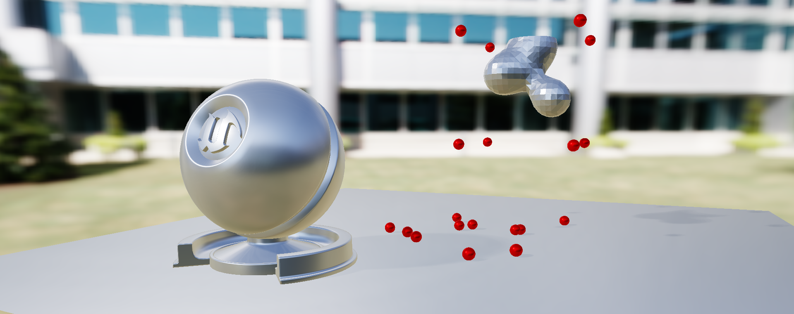
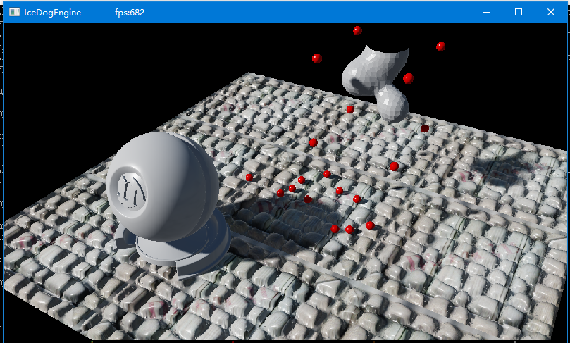
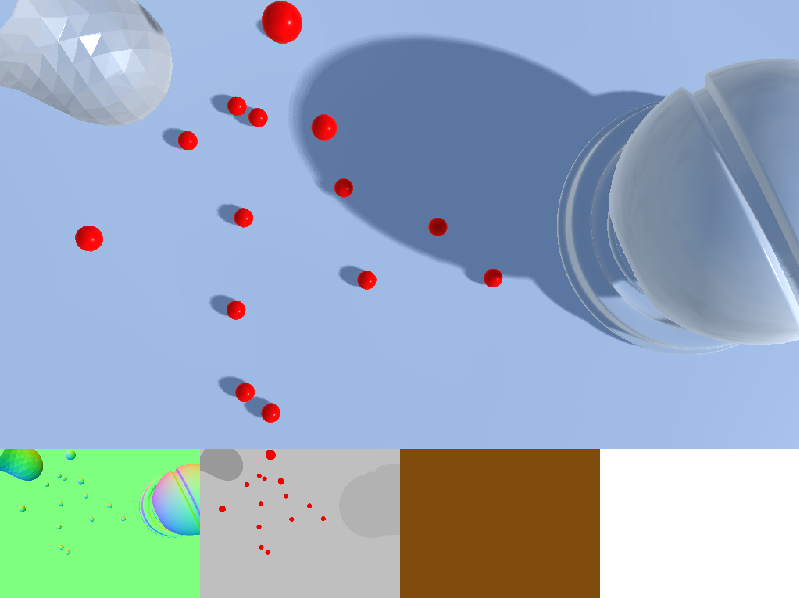
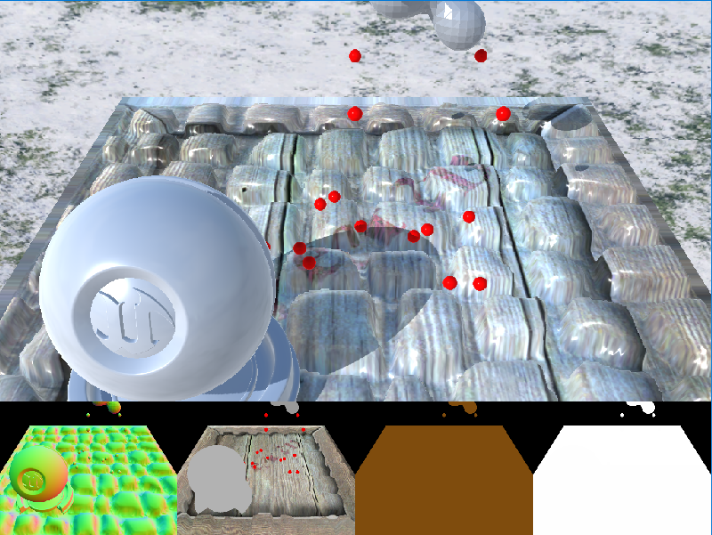
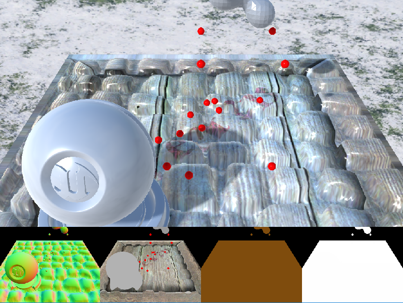

# A Voxel Game Engine Demo

* deferred shading.
* physic based shading.
* Image based lighting.
* GPU marching cube.
* parallax mapping.

## Developing

# What`s new?

## Add Ability to Read From RGBE File And Create A Cubemap From It
### HDR Rendering is now avilable! Add tone mapping!
### Add a HDR image

## The Cubemap Prefiltering Is Done!
### Some IBL bug has also be fixed. Now, I sure it`s physical based.

## Tone Mapping Confuse Me

## The Effect Framework Had Been Totlly Removed!
### Replaced with a new shader framework, with higher release mode performance. There seems some problem, the performance on the debug mode is lower.
### Now the shader can be compiled offline freely and join at any time. A real material framework is on the way now!
### All shader in a single fx file has been separated into many hlsl file now.

## The Shader Now Is Compiled Offline
### The effect framework will soon be removed.

## Add PCSS Like Shadow
This is not the origin pcss shadow of NVIDIA.

## Add PCF Shadow

### Old

### Now

## Add Memory Management
### Right! I haven`t done this until now. Oooops...
