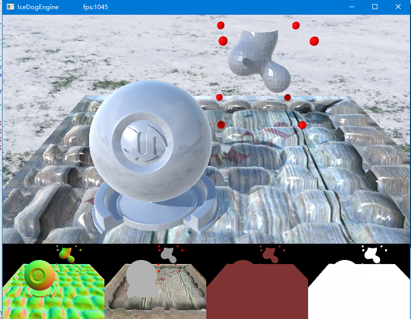
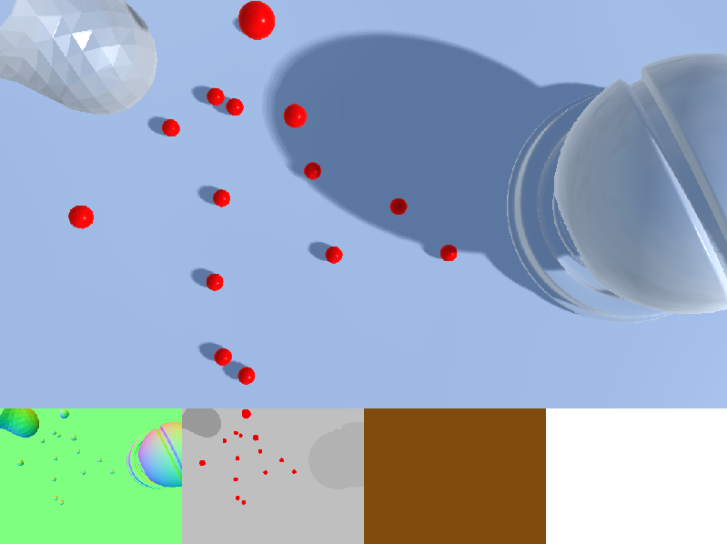
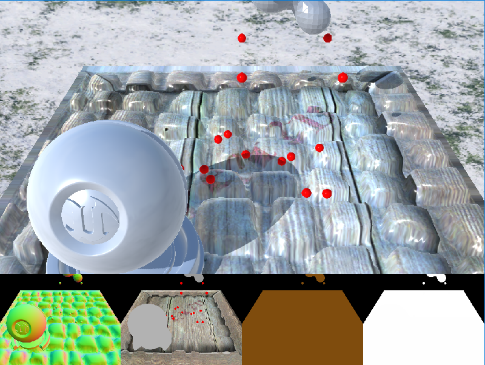
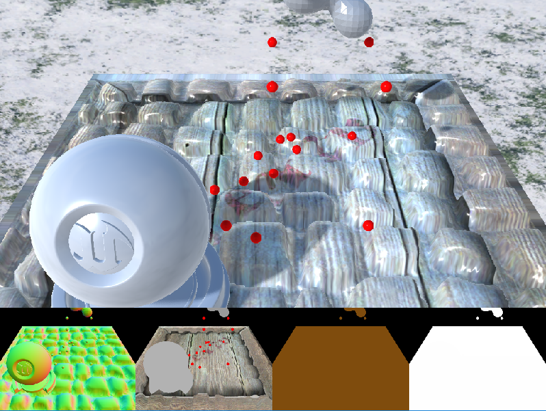

# A Voxel Game Engine Demo

* deferred shading.
* physic based shading.
* Image based lighting.
* GPU marching cube.
* parallax mapping.

## Developing

# What`s new!

## Add PCSS Like Shadow
This is not the origin pcss shadow of NVIDIA.

## Add PCF Shadow

### Old

### Now

